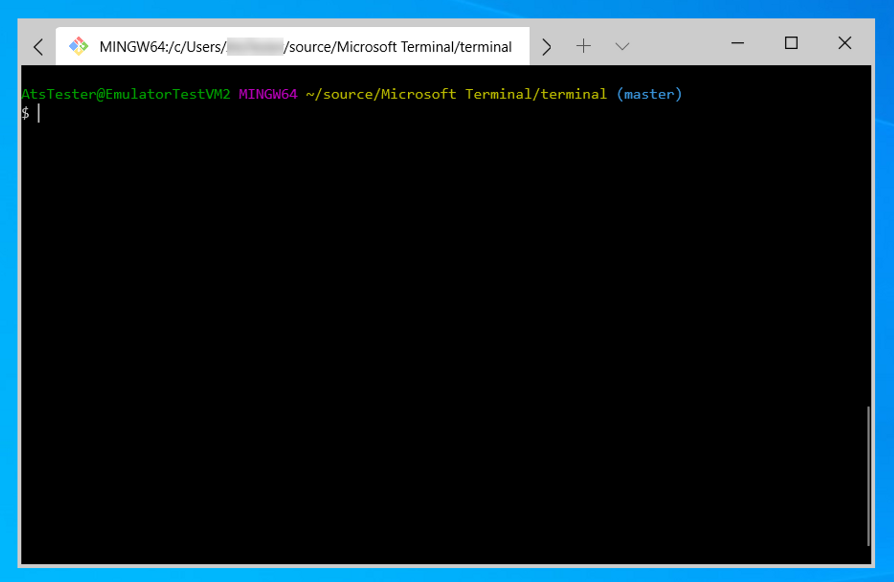
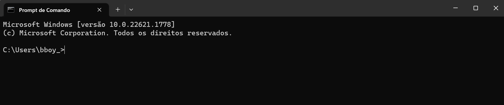
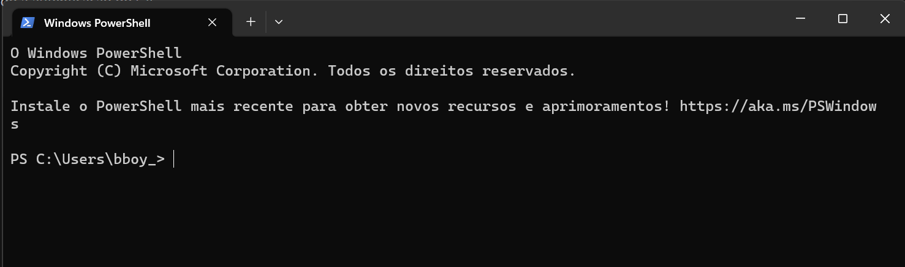

# Introdução a Terminal e linhas de comando(CLI)

<aside>
 Boas-vindas ao emocionante mundo do desenvolvimento Web Full Stack! Aqui, você dará os primeiros passos no módulo de Fundamentos, mergulhando de cabeça no primeiro conteúdo: Terminal e Git.

</aside>

# Terminal

Um terminal, também conhecido como linha de comando(CLI) ou prompt de comando, é uma interface de texto que permite que você comunique com o computador usando comandos de texto. É como uma janela onde você pode digitar instruções diretamente para o computador executar.

Com o terminal, você pode realizar diversas tarefas no computador. Por exemplo, pode criar, copiar e excluir arquivos, navegar pelas pastas do seu sistema, instalar programas, executar scripts, fazer configurações avançadas e muito mais. Ele oferece uma forma de interagir com o computador e executar ações específicas.

Embora possa parecer um pouco intimidador no início, o terminal é uma ferramenta útil e flexível para usuários avançados e desenvolvedores, pois permite um controle mais preciso e eficiente sobre o computador. 

# Tipos de terminal

## Bash

Terminal git bash. 

O Bash (Bourne Again SHell) é um dos terminais mais populares e amplamente utilizados em sistemas baseados em Unix, como **Linux** e **macOS**. Ele fornece um terminal com suporte a sequencias de comando(scripts), expansão de comandos e uma ampla gama de utilitários integrados.

<aside>
💡  Computadores com Windows não possuem o bash integrado. Por isso o instalador do Git é necessário (ele vem com o Git Bash, que é um terminal Bash para Windows)**.** O **bash** será nosso foco de estudo.

</aside>

## CMD

O CMD (Command Prompt) é o terminal padrão nos sistemas Windows. Embora seja menos flexível e possua menos recursos avançados em comparação com outros terminais, ainda é amplamente utilizado.

## PowerShell

Power Shell 

O PowerShell é um terminal e uma linguagem de script desenvolvida pela Microsoft para sistemas Windows. Ele fornece uma experiência de linha de comando mais avançada.

## Video complementar

https://vimeo.com/806567015/e56b6fb8c4?share=copy

# Resumo

1. Um terminal  permite interagir com o computador usando comandos.
2. O terminal oferece diversas funcionalidades, como criar, copiar e excluir arquivos, navegar pelas pastas do sistema, instalar programas, executar scripts e fazer configurações avançadas.
3. O Bash é um dos terminais mais populares e amplamente utilizados em sistemas baseados em Unix, como Linux e macOS. 
4. O CMD é o terminal padrão nos sistemas Windows, embora seja menos flexível e tenha menos recursos avançados.
5. O PowerShell é um terminal desenvolvido pela Microsoft para sistemas Windows.