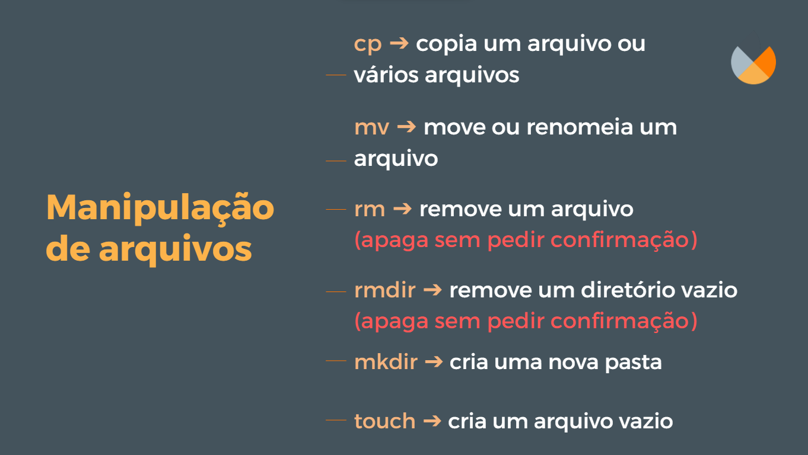
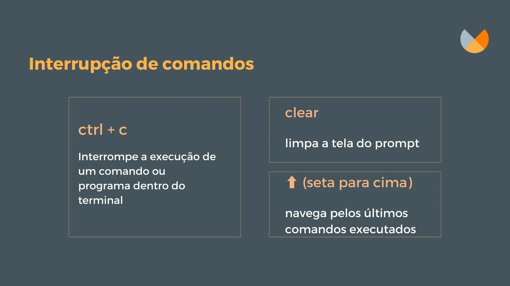

# Principais comandos no Terminal

<aside>
 Abaixo, apresentaremos uma variedade de comandos distintos e essenciais para o seu processo de aprendizado. Não se preocupe em memorizá-los todos de uma só vez. Ao longo do curso, você terá muitas oportunidades para praticá-los, e esses comandos se tornarão cada vez mais familiares com o tempo. O mais importante é praticar e se familiarizar gradualmente com cada um deles.

</aside>

# Comandos de navegação


### **`pwd` -** Mostrar a pasta atual

O comando **`pwd`** é uma abreviação de "print working directory" (imprimir diretório de trabalho). Quando você executa o comando **`pwd`** no terminal, ele exibe o caminho completo do diretório(pasta do computador) atual em que você está trabalhando.

```bash
**pwd**
```

### **`cd` -** Mudar de pasta

O comando **`cd`** é uma abreviação de "change directory" (mudar diretório) e é usado para navegar nas pastas do computador.

Ao executar o comando **`cd`** seguido do nome da pasta, você será direcionado para esse diretório. Por exemplo, se você digitar **`cd Desktop`**, o terminal mudará para o diretório  chamado "Desktop", que é a área de trabalho no Windows.

O **`cd`** também suporta caminhos absolutos e relativos. Um caminho absoluto é o caminho completo até o diretório, começando na raiz do sistema de arquivos, como por exemplo **`cd /c/Users/seu-nome/Desktop`**. Já um caminho relativo é relativo ao diretório atual, por exemplo, se você estiver no diretório "/c/Users/seu-nome", você pode usar **`cd Desktop`**para entrar na pasta "Desktop".

É possível utilizar alguns caracteres especiais com o comando **`cd`**. O símbolo **`..`** permite voltar um diretório acima, por exemplo, **`cd ..`** te levará ao diretório pai do diretório atual. O caractere **`~`** representa o diretório home de user, portanto, **`cd ~`** te levará ao diretório home (no Windows é “/c/Users/seu-nome”).

# Comandos de Manipulação de arquivos



### `cp` - Copiar arquivos

O comando `cp` (copy)é usado para copiar arquivos e diretórios. Você especifica o arquivo ou diretório que deseja copiar e o destino para onde deseja copiá-lo.

Exemplo: Suponha que você queira copiar um arquivo chamado "arquivo.txt" de uma pasta chamada "origem" para uma pasta chamada "destino". O comando seria:

```bash
cp origem/arquivo.txt destino/
```

### `mv` - Mover arquivos

O comando `mv` (move) é usado para mover arquivos e diretórios. Ele também pode ser usado para renomear arquivos ou diretórios, já que mover um arquivo para o mesmo local com um nome diferente resulta em uma mudança de nome.

Exemplo: Se você deseja mover um arquivo chamado "arquivo.txt" de uma pasta chamada "origem" para uma pasta chamada "destino", o comando seria:

```bash
mv origem/arquivo.txt destino/
```

### `rm` - Remover arquivos

O comando `rm`(remove) é usado para remover (apagar) arquivos. Tenha cuidado ao usar este comando, pois os arquivos excluídos não são enviados para a lixeira e serão apagados permanentemente.

Exemplo: Para remover um arquivo chamado "arquivo.txt" da pasta atual, o comando seria:

```bash
rm arquivo.txt
```

### `rmdir` - Remover diretórios

O comando `rmdir` é usado para remover diretórios **varzios**. 

Exemplo: Para remover um arquivo chamado "arquivo.txt" da pasta atual, o comando seria:

```bash
rmdir  pastaSemArquivos
```

### `mkdir` - Criar novos diretórios

O comando `mkdir`(make directory)é usado para criar um novo diretório (pasta). Você especifica o nome do diretório que deseja criar.

Exemplo: Para criar um novo diretório chamado "novapasta", o comando seria:

```bash
mkdir novapasta
```

### `touch` - Criar novos arquivos

O comando `touch` é usado para criar um novo arquivo vazio ou atualizar o horário de modificação de um arquivo existente.

Exemplo: Se você deseja criar um novo arquivo chamado "novoarquivo.txt", o comando seria:

```bash
touch novoarquivo.txt
```

# Comandos de listagem e busca


### `ls` - Listar todo o conteúdo do diretório

Quando você digita apenas `ls`, o comando lista o conteúdo do diretório atual.

Exemplo: Ao digitar `ls`, o terminal irá mostrar uma lista dos arquivos e pastas presentes no diretório atual.

### `ls -l`- Listar todo o conteúdo do diretório com mais detalhes

Ele mostra informações adicionais sobre os arquivos, como permissões, tamanho, data de modificação e proprietário.

### `ls -a`- Listar todos arquivos de um directório, incluindo arquivos ocultos

Exibe todos os arquivos e pastas, incluindo os ocultos. No Windows e em alguns outros sistemas, os arquivos ocultos começam com um ponto (por exemplo, `.nome-do-arquivo`). Ao digitar `ls -a`, o terminal irá mostrar todos os arquivos e pastas no diretório atual, incluindo os ocultos, se houver.

### `ls -la`- Listar todos arquivos de um directório com detalhes, incluindo arquivos ocultos

O comando `ls -la` combina as opções `l` e `a`, exibindo uma lista detalhada de todos os arquivos e pastas, incluindo os ocultos.

# Interrupção de comandos



### **`Ctrl + C` -** interromper a execução de um comando ou programa em andamento

No Bash, o atalho de teclado Ctrl + C é usado para interromper a execução de um comando ou programa em andamento. Quando você pressiona essas teclas, o Bash envia um sinal de interrupção (SIGINT) para o processo em execução, solicitando que ele seja encerrado.

Exemplo: Suponha que você esteja executando um comando que está levando muito tempo e você deseja interrompê-lo. Basta pressionar Ctrl + C no terminal para interromper a execução.

### `clear` - limpar a tela do terminal

É usado para limpar a tela do terminal, removendo todo o conteúdo anteriormente exibido. Isso ajuda a manter o terminal limpo e organizado.

Exemplo: Ao digitar `clear` no terminal e pressionar Enter, a tela será limpa, removendo todo o histórico de comandos e resultados anteriores.

### ⬆️⬇️ Setas para cima e para baixo do teclado

No Bash, você pode usar as setas para cima e para baixo no teclado para navegar pelo histórico de comandos que você digitou anteriormente. Isso permite que você reutilize comandos rapidamente, sem precisar digitá-los novamente.

Exemplo: Suponha que você tenha digitado um comando longo anteriormente e agora deseja executá-lo novamente. Basta pressionar a seta para cima no teclado para recuperar o comando anteriormente digitado e pressionar Enter para executá-lo novamente.

## Video complementar

[Principais comandos do terminal.mp4](./img-e-vídeos/Principais_comandos_do_terminal.mp4)

# Resumo

| Comando/Atalho | Descrição | Exemplo de Uso |
| --- | --- | --- |
| cp | Copia arquivos e diretórios | `cp origem/arquivo.txt destino/` |
| mv | Move ou renomeia arquivos e diretórios | `mv origem/arquivo.txt destino/` |
| rm | Remove (apaga) arquivos | `rm arquivo.txt` |
| rmdir | Remove (apaga)  diretórios | `rm pastaSemArquivos` |
| mkdir | Cria um novo diretório (pasta) | `mkdir novapasta` |
| touch | Cria um novo arquivo vazio ou atualiza o horário de modificação | `touch novoarquivo.txt` |
| ls | Lista o conteúdo de um diretório | `ls` |
| ls -l | Lista o conteúdo de um diretório em formato detalhado | `ls -l` |
| ls -a | Lista todo o conteúdo de um diretório, incluindo arquivos ocultos | `ls -a` |
| ls -la | Lista todo o conteúdo de um diretório em formato detalhado | `ls -la` |
| Ctrl + C | Interrompe a execução de um comando ou programa em andamento | Pressionar Ctrl + C durante a execução de um comando |
| clear | Limpa a tela do terminal | `clear` |
| Setas do teclado | Navega pelo histórico de comandos digitados anteriormente | Pressionar seta para cima para acessar comandos anteriores |