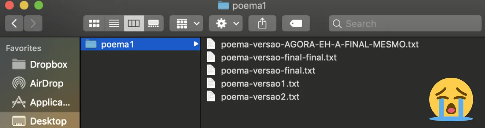
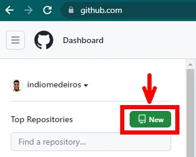
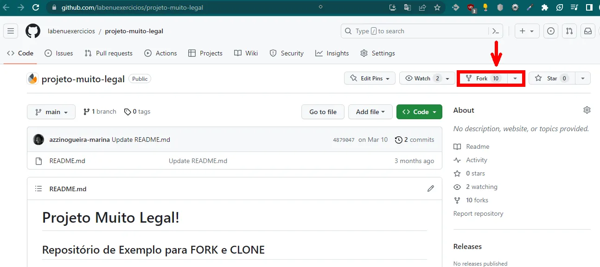
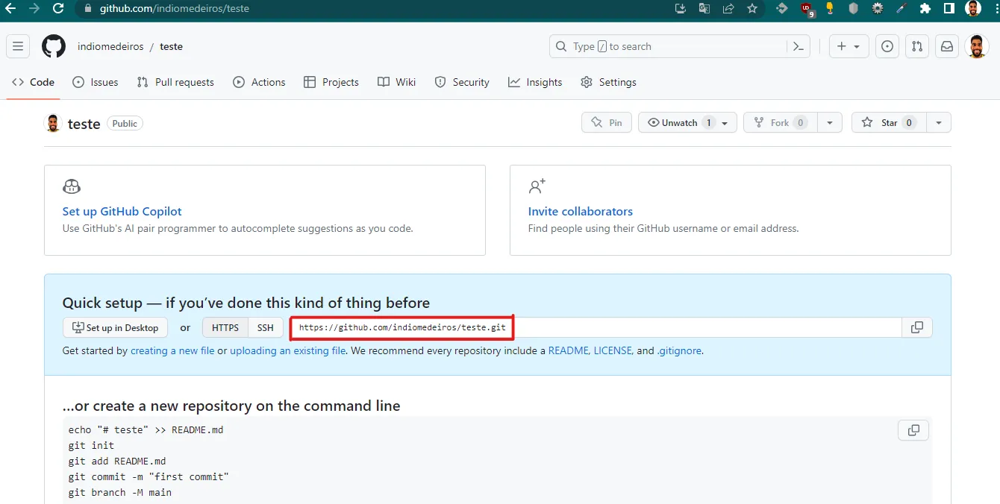
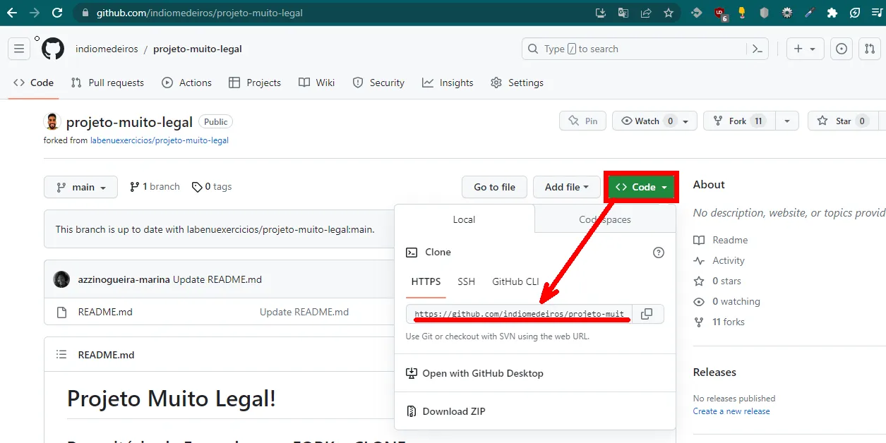
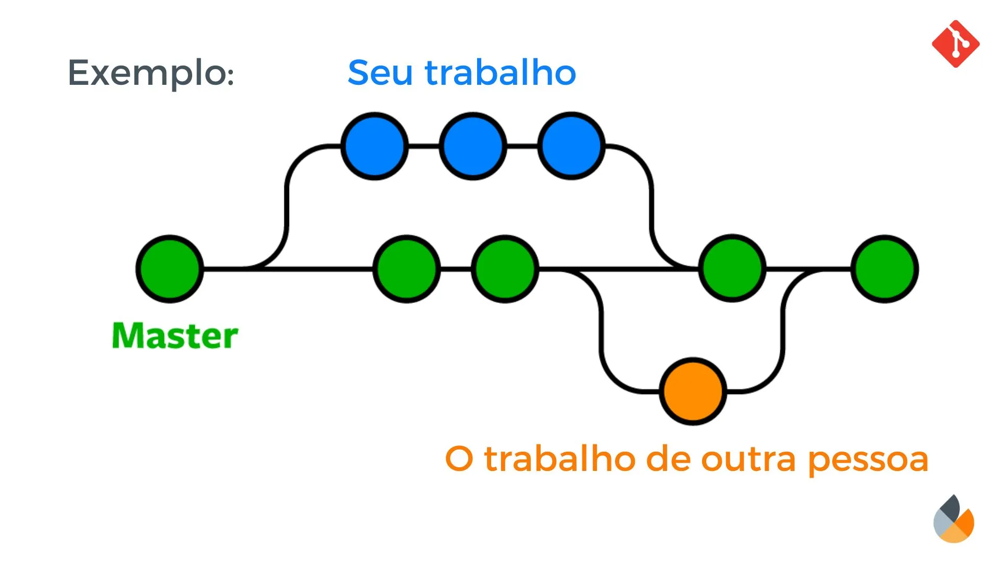

# Introdução ao Git e seus principais conceitos

<aside>
 Boas vindas ao empolgante mundo do Git! Aqui, você mergulhará em um universo de controle de versão e colaboração no desenvolvimento de software. Lembre-se de que aprender Git é um passo fundamental para o crescimento profissional. Enfrentaremos os desafios com determinação e estaremos aqui para te apoiar em cada etapa dessa jornada.

</aside>

# **Motivação**

Todo mundo que já fez algum trabalho em grupo na escola já passou por uma situação que nem a da imagem abaixo:



## **Como a gente fazia o trabalho?**

- Cada um mandava a sua parte e, no final, o colega mais organizado do grupo juntava e formatava tudo;
- Criamos várias versões para não perder o que cada colega fez;
- Ou então pra poder voltar atrás em alguma decisão, ver a evolução do projeto, etc.

### **Gerenciamento de Versões**

- **Git** é uma ferramenta que gerencia versões de um projeto. Ele também consegue fazer um acompanhamento do que as diferentes pessoas do projeto fizeram.

# Principais conceitos

## **Repositórios**

- Um repositório é como se fosse uma pasta onde ficará o nosso projeto. Chamamos também de **repo.**
- Existe o **repositório local** (que fica no seu computador) e o **repositório remoto** (que fica na núvem).
- A plataforma que vamos usar para armazenar nossos repositórios remotos é o **GitHub**

## Criando um repositório no GitHub

- Para criar um repositório remoto, devemos estar com login feito no Github;
- Na página inicial do github, selecionamos o botão **new**, do lado esquerdo da tela.
    
    
    

## Copiando um repositório com o Fork

- Podemos copiar um repositório remoto já existente para nossa conta utilizando o botão Fork. Assim, podemos ter nossa própria versão do repo em nossa conta.



link do repositório de exemplo: https://github.com/labenuexercicios/projeto-muito-legal

## Baixando o repositório no seu computador

- Para baixar um repositório remoto na sua máquina, precisamos do link desse repo
- Ele fica na página do github do projeto!
    
    
    
    Ou no seu repositório forkado, clique no botão “Code” e na aba “HTTPS”:
    
    
    
- Uma vez copiado o link, você deve ir ao terminal, navegar até a pasta onde você quer colocar o projeto e digitar o seguinte comando:

```bash
**git** clone <<link do repo>>
```

- Depois que o download terminar, uma pasta com os arquivos do projeto aparecerá na sua máquina!

## Branches

- O git nos possibilita ramificar o desenvolvimento de um arquivo em estruturas que chamamos de branches.
- Se pensarmos nas versões como uma linha do tempo, uma branch representa uma bifurcação no código.
- Criamos branches sempre que precisamos trabalhar em diferentes pedaços de um projeto em paralelo, conforme a seguinte imagem:



**No dia a dia criamos ramificações para preservar o projeto**

enquanto trabalhamos em features ou funcionalidades diferentes dentro do projeto, para criar um ramo estável de desenvolvimento, de testes ou de homologação, por exemplo.

Todo projeto possui uma branch principal que chamamos de **main branch.**

## **Ramificando um projeto**

A partir do nosso repositório, podemos criar uma nova branch com o seguinte comando.

```bash
git branch <<nome-da-branch>>
```

Se você quiser visualizar todas as branches abertas no projeto, basta omitir o nome da branch no comando acima.

```bash
git branch
```

### **Mudando de branch**

Para entrar em uma branch já existente, utilizamos o comando abaixo:

```bash
git checkout <<nome-da-branch>>
```

Dessa forma você vai conseguir ver o código que foi realizado nessa ramificação.

## Video complementar

[Introdução ao Git e seus Principais Conceitos.mp4](./img-e-vídeos/Introdução%20ao%20Git%20e%20seus%20Principais%20Conceitos.mp4)

Link do repositório usado na videoaula : https://github.com/labenuexercicios/projeto-muito-legal

# Resumo

| Comando | Descrição |
| --- | --- |
| `git clone` <<link do repo>> | Baixa um repositório remoto para o seu computador |
| `git branch` <<nome-da-branch>> | Cria uma nova branch no repositório local |
| `git branch` | Lista todas as branches abertas no projeto |
| `git checkout` <<nome-da-branch>> | Muda para uma branch existente no repositório local |