# Configurando **a autenticação do GitHub**

Certifique-se que você possua o GitBash ou algum terminal que permita escrever em Bash e usar os comandos do Git. Se não tiver, realize o download de acordo com [esse guia](https://www.canva.com/design/DAFBPzOHcMQ/view).

Tudo pronto? Vamos lá!

## Autenticação no github

### Token de acesso

- Veja aqui um passo a passo sobre como gerar um token de acesso
    
    1. Faça o Login no Github clicando [**aqui**](https://github.com/login);
    
    2. Na página principal, clique no ícone da sua foto, que fica no canto superior direito onde está sua foto (opção *view profile and more*), e selecione a opção **Settings**;
    
    .webp)
    
    3. Na tela de settings, vá descendo entre as opções do lado esquerdo, e selecione **Developer Settings**
    
    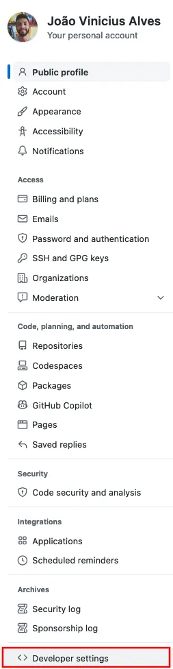
    
    4. Em seguida, clique na opção **Personal access tokens** e em **Tokens(classic)**, na lista que aparecerá ao lado, selecione **Generate new token** e em seguida **Generate new token(classic)**. Ao fazer isso, é possível que peçam novamente sua senha. Digite a senha normalmente e podemos prosseguir.
    
    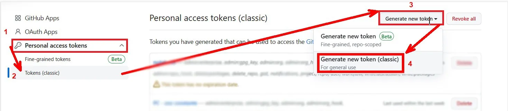
    
    <aside>
    💡 **Quer um atalho? clique no link**: https://github.com/settings/tokens/new **e faça o login.**
    
    </aside>
    
    5. Defina as configurações do novo Token. As configurações que precisam ser definidas são: Nome do Token, Duração do token (aqui sugerimos 365 dias, que pode ser definido escolhendo a opção ***Custom***), e suas permissões. Para o que vamos fazer aqui na Labenu, basta preencher as opções que estão em **repo, workflow, admin:org** e clicar em **Generate token** no final da página**.**
    
    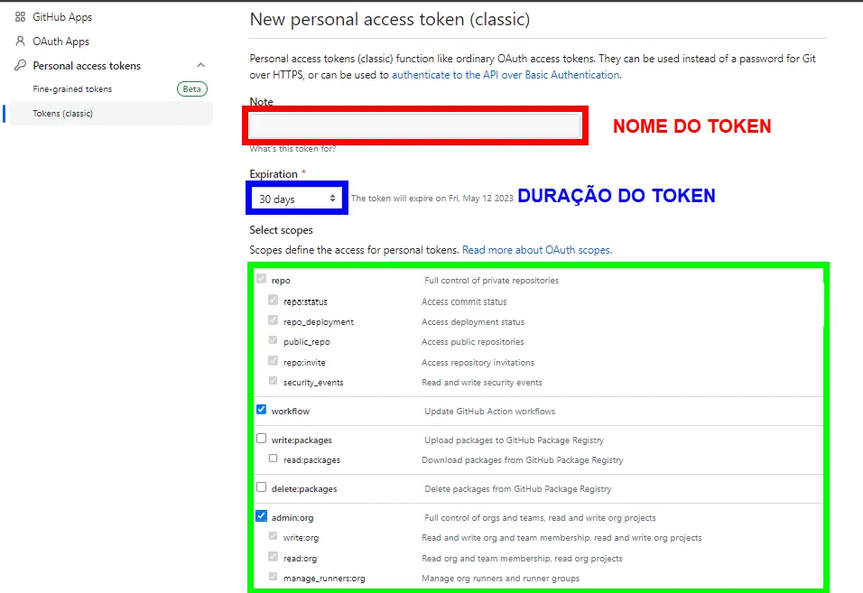
    
    6. **Copie o token gerado.** Ele não vai aparecer de novo para você!
    
    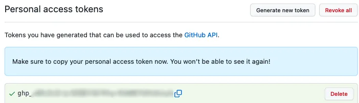
    

### Autenticação com o token

- Veja aqui um passo a passo como fazer autenticação com o token
    - Para usuários do **Windows**
        1. Baixe o instalador do github CLI(gh) para Windows no site oficial do Github: [**https://cli.github.com/**](https://cli.github.com/)
        2. Abra o arquivo baixado, que deve estar no formato .exe, e siga as instruções na tela para instalar o gh.
        3. Quando a instalação estiver concluída, abra o **prompt de comando** do Windows (pressione as teclas Win+R, digite "cmd" e pressione Enter).
        Anteção! Para essa parte é o **CMD** e não o git bash!
            
            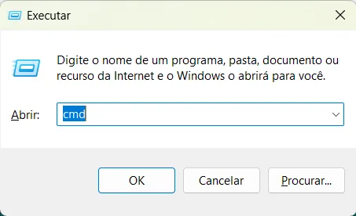
            
        4. Digite o comando **`gh --version`**e pressione “Enter” para verificar se o gh foi instalado corretamente e exibir a versão atual.
            
            
            
        5. Para autenticar o gh com o seu token, execute o seguinte comando no terminal:
            
            ```powershell
            gh auth login
            ```
            
        6. O terminal vai fazer algumas perguntas então use as setas do teclado, tecla “y” e a “enter” para responder como o exemplo abaixo. Siga até pedir o token:
            
            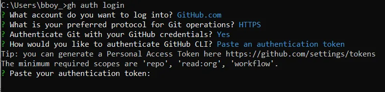
            
        7. Copie o token e cole no espaço reservado clicando com o botão direito do mouse. Em seguida, pressione Enter.
            
            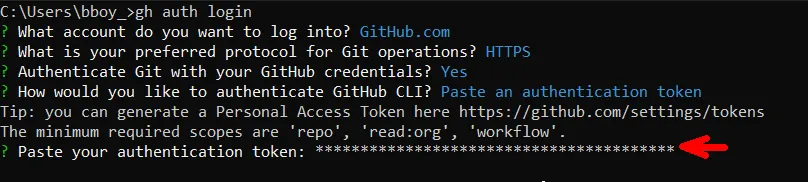
            
            ## Video complementar
            
            [autenticação com gh.mp4](./img-e-vídeos/autenticação%20com%20gh.mp4)
            
        
        Depois de efetuar login, verifique se a autenticação foi bem-sucedida digitando o seguinte comando no terminal:
        
        ```bash
        gh auth status
        ```
        
        Se tudo estiver correto, o resultado será semelhante à imagem abaixo:
        
        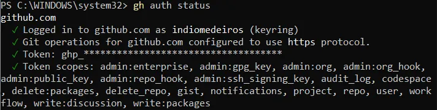
        
        Se o login falhar, tente repetir  processo de login novamente partindo da **instrução número 5** desse tutorial.
        
    - Para usuários do **Linux**
        1. Abra o terminal com o atalho “Ctrl + Alt + T”
        2. Atualize a lista de pacotes disponíveis para o sistema
            
            ```bash
            sudo apt update
            ```
            
        3. Faça a instalação do github CLI(**gh**) para para configurar a autenticação.
            
            ```bash
            sudo apt install gh
            ```
            
        4. Digite o comando **`gh --version`**e pressione “Enter” para verificar se o gh foi instalado corretamente e exibir a versão atual.
            
            ```bash
            gh --version
            ```
            
        5. Para autenticar o gh com o seu token, execute o seguinte comando no terminal:
            
            ```bash
            gh auth login
            ```
            
        6. O terminal vai fazer algumas perguntas então use as setas do teclado, tecla “y” e a “enter” para responder como o exemplo abaixo. Siga até pedir o token:
            
            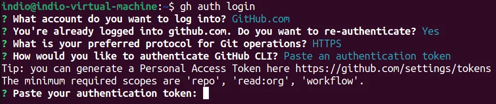
            
        7. Copie o token e cole no espaço reservado clicando com o botão direito do mouse. Em seguida, pressione Enter.
            
            
            
            ## Video complementar
            
            [autenticação com gh linux.mp4](./img-e-vídeos/autenticação%20com%20gh%20linux.mp4)
            
        
        Depois de efetuar login, verifique se a autenticação foi bem-sucedida digitando o seguinte comando no terminal:
        
        ```bash
        gh auth status
        ```
        
        Se tudo estiver correto, o resultado será semelhante à imagem abaixo:
        
        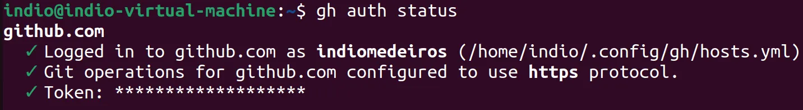
        
        Se o login falhar, tente repetir  processo de login novamente partindo da **instrução número 5** desse tutorial.
        
    - Para usuários do **Mac**
        - Vídeo guia para macos
            
            [video1175909309.mp4](./img-e-vídeos/video1175909309.mp4)
            
        1. Abra o terminal com o atalho:  **`Command + espaço`**para abrir a barra de pesquisa do Spotlight e, em seguida, digite "Terminal" e pressione **`Enter`**
        2. Faça a instalação do github CLI(**gh**) para para configurar a autenticação.
            
            Digite o comando abaixo e pressione “Enter”.
            
            ```bash
            brew install gh
            ```
            
            - caso apareça a mensagem de que o comando brew não foi encontrado, abra esse toggle <
                
                rode o comando abaixo no terminal:
                
                ```bash
                /bin/bash -c "$(curl -fsSL https://raw.githubusercontent.com/Homebrew/install/HEAD/install.sh)"
                ```
                
        3. Verifique se o gh foi instalado corretamente e exibir a versão atual.
            
            Digite o comando abaixo e pressione “Enter”.
            
            ```bash
            gh --version
            ```
            
        4. Para fazer a autenticação com o token digite o comando abaixo e pressione “Enter”
            
            ```bash
            gh auth login
            ```
            
        5. O terminal vai fazer algumas perguntas, então use as setas do teclado, tecla “y” e a “enter” para responder como o exemplo abaixo. Siga até pedir o token:
            
            
            
        6. Copie o token e cole no espaço reservado clicando com o botão direito do mouse. Ao final aperte o “enter”.
            
            
            
            ## Video complementar
            
            [autenticação com gh linux.mp4](./img-e-vídeos/autenticação%20com%20gh%20linux.mp4)
            
            Depois de efetuar login, verifique se a autenticação foi bem-sucedida digitando o seguinte comando no terminal:
            
            ```bash
            gh auth status
            ```
            
            Se tudo estiver correto, o resultado será semelhante à imagem abaixo:
            
            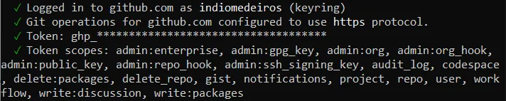
            
            Se o login falhar, tente repetir  processo de login novamente partindo da **instrução número 4** desse tutorial.
            

## Configuração do git

- Faça a configuração do usuário e email do git usando o terminal.
    
    Para começar a usar o Git, é importante configurar o nome de usuário e o endereço de e-mail, que serão usados para identificar as alterações feitas no repositório. 
    
    1. Abra o terminal do seu sistema operacional.
    2. Configure o nome do usuário, digitando o seguinte comando no terminal:
        
        ```bash
        git config --global user.name "Seu nome"
        ```
        
        Substitua "Seu nome" pelo seu nome real. Esse nome será usado para identificar as suas alterações no repositório.
        
    3. Configure o endereço de e-mail, digitando o seguinte comando no terminal:
        
        ```bash
        git config --global user.email "seuemail@example.com"
        ```
        
        Substitua "[**seuemail@example.com**](mailto:seuemail@example.com)" pelo seu endereço de e-mail real. Esse endereço será usado para associar as suas alterações ao seu perfil no GitHub ou em outro serviço de hospedagem de código.
        
    4. Verifique se as credenciais foram registradas corretamente, digitando o seguinte comando no terminal:
        
        ```bash
        git config --global --list
        ```
        
        O resultado deve incluir as informações do usuário e do e-mail que você acabou de configurar, como:
        
        ```bash
        user.name="Seu nome"
        user.email= "seuemail@example.com"
        ```
        
        Se as informações não estiverem corretas ou não aparecerem no resultado, repita os procedimentos para configurar o nome de usuário e o endereço de e-mail corretamente.